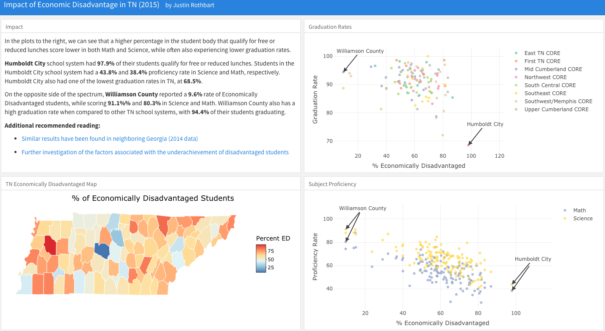

# TN Achievement Gap Analysis

### Inspiration
Heading into this data question, I had an understanding of the correlation between socioeconomic background and educational performance, but wanted to explore the strength of the correlation in Tennessee.

### Data Selection
County-level academic data was provided by the TN Department of Education, while zip-code level tax data is publicly available. The data was able to be joined based on zip codes and counties, with some overlap when a zip code is shared across counties.

### Data Cleaning
The data was pretty clean, so there wasn't a lot of cleaning up to perform. That's a first!

### Visualizations
I created a [flexdashboard](https://rmarkdown.rstudio.com/flexdashboard/) to form a dashboard that hosted different pieces of information. I used [plotly](https://plot.ly/r/) for my graphs, which allowed for hover information. I also used arrows to highlight specific points on the graphs, which helped tell the story.

### Storytelling
I wanted my dashboard to be a single tab, which would prevent the dashboard from becoming too cluttered and force me to keep my information simple and direct.

I created a "Summary" tab in the top-left quadrant to provide some statistics and additional references. The bottom-left quadrant contains a map of TN with outlines for each county, which is color-coded based on the percent of Economically Disadvantaged students in the county.

The two scatter plots on the right-hand side are the main visualizations that help illustrate my hypothesis. I compare the graduation rates and the economically disadvantaged rates, and highlight both the low and high performers. This helps drive the user to my intended analysis.

## Packages Used

* **flexdashboard** for creating the dashboard.
* **dplyr** for data manipulation.
* **Plotly** for interactive data visualizations.
* **ggplotly** for creating the interactive map of TN.

## Project Screenshots

### TN Achievement Gap Analysis Dashboard

## Lessons Learned
* **It's OK to be Obvious** - The analysis that I performed on this project wasn't ground-breaking, and I felt confident that I knew that my data would support existing thought, but I'm glad I still pursued it. Regardless of how many articles, websites, or podcasts that have previously covered the topic, I still learned a lot from exploring the data, and other people might respond to my dashboard more than they had with other mediums.
* **Be Clear and Precise** - Don't expect the consumer to know what they should be doing. Draw their eyes to the parts of your dashboard that you think are important by sparingly using colors, size, or even arrows!
